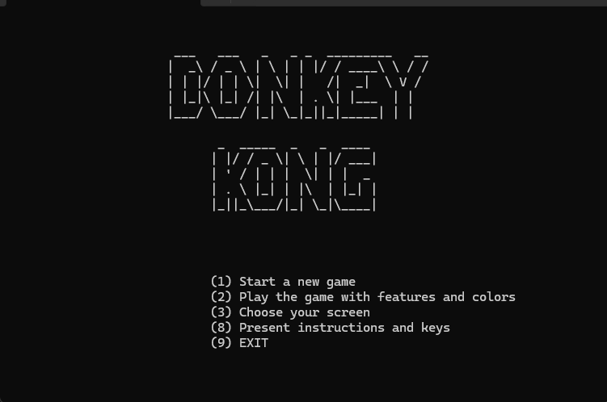
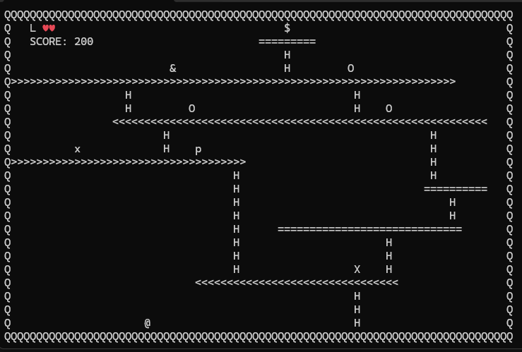
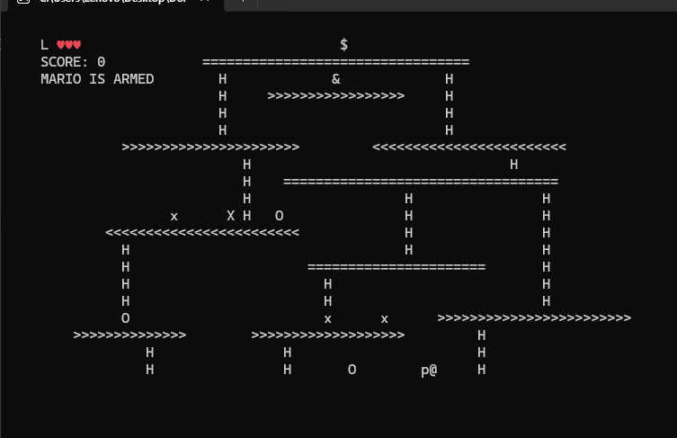

Donkey Kong Console Game (C++)

This C++ console game is a recreation of the classic "Donkey Kong" arcade game. 
The game is written using Object-Oriented Programming (OOP) principles. 
The player controls Mario, who must avoid ghosts and barrels thrown by Donkey Kong, climb ladders, and rescue Pauline.

## Build (Visual Studio 2022)
- Open `DonkeyKongGame.vcxproj`
- Build (x64 recommended)

## Run modes
- Play: `DonkeyKongGame.exe`
- Save a run: `DonkeyKongGame.exe -save`
- Replay from files: `DonkeyKongGame.exe -load`
- Replay (silent): `DonkeyKongGame.exe -load -silent`

## Controls
- Move: `a` `d` `w` `x` (left/right/up/down)
- Stay: `s`
- Hammer: `p`

## Files
- `dkong_XX.screen`: level layout
- `dkong_XX.steps`: recorded inputs (for replay)
- `dkong_XX.result`: expected events + final score (for replay)

## Screenshots

